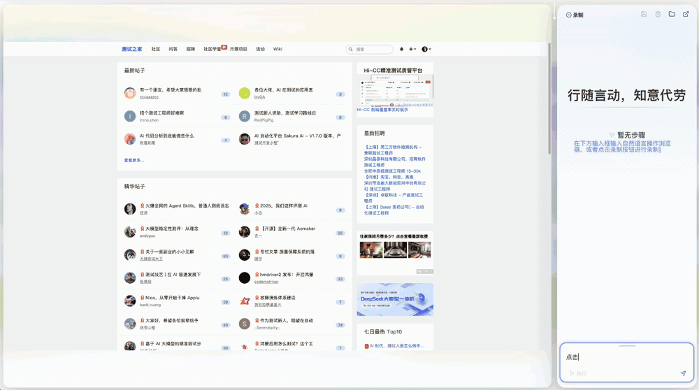
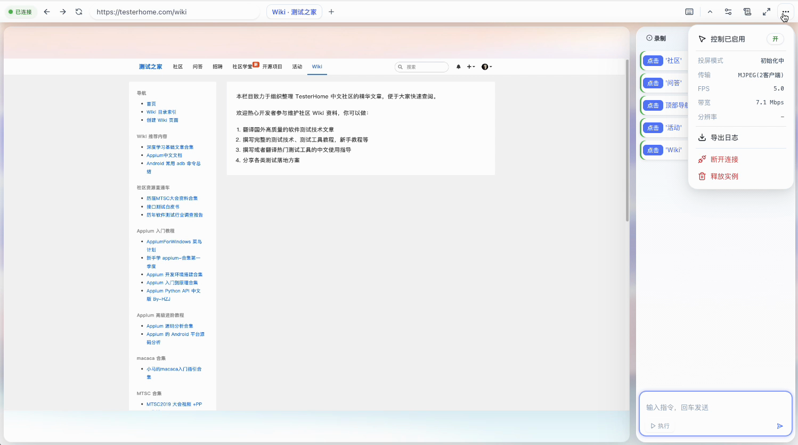
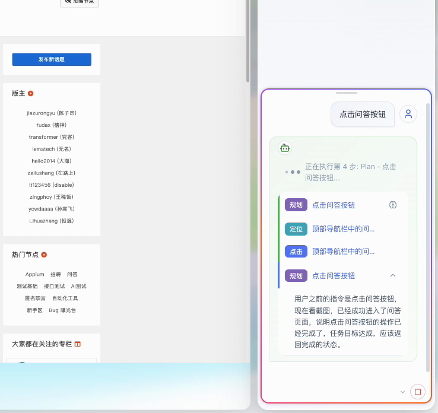
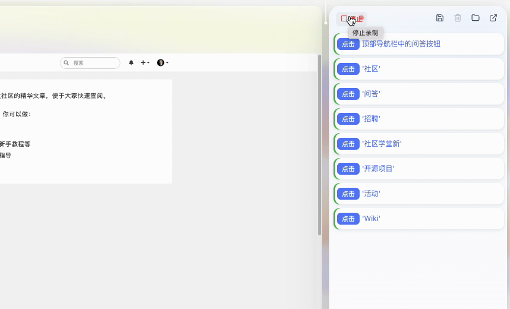
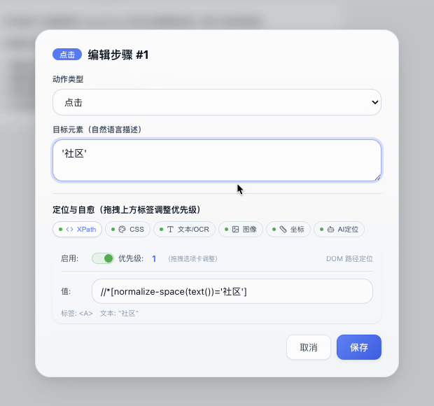
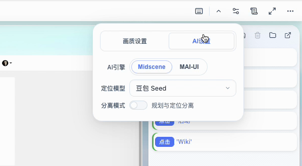
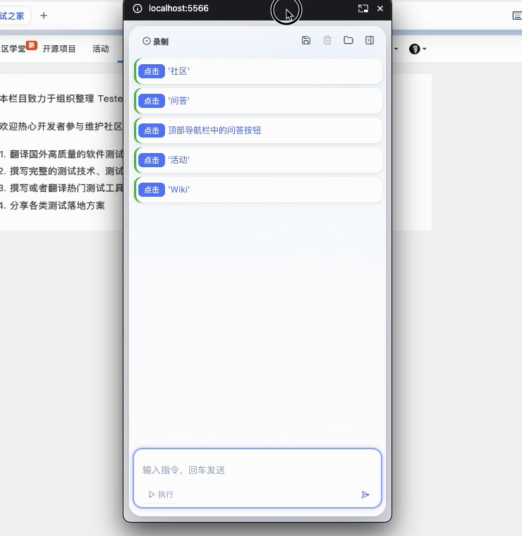

<p align="center">
  
</p>

<h1 align="center">Ruyi (如意)</h1>

<p align="center">
  <b>An AI browser-automation workbench</b><br>
  Talk to a live, remotely streamed Chrome. It plans, locates, acts, and turns every action into a self-healing script.
</p>

<p align="center">
  <a href="LICENSE"></a>
  
  
  
  
</p>

<p align="center">
  <a href="#what-this-demo-validates">What it validates</a> ·
  <a href="#quick-start">Quick start</a> ·
  <a href="#what-it-does">What it does</a> ·
  <a href="#who-its-for">Who it's for</a> ·
  <a href="#roadmap">Roadmap</a> ·
  <a href="README.md">中文</a>
</p>

> **Technical-validation demo**: one complete user flow that exercises the streaming and AI-automation techniques listed below. Run from source. Developed and verified on macOS; Linux and Windows launch scripts are included but not systematically tested. You need an API key for a vision-language model (Qwen3-VL, Doubao, GPT-4o, Claude, Gemini all work) or a local model.

<p align="center">
  
</p>
<p align="center">
  <sub>Typing "click the Q&amp;A button": the AI plans first, then locates the Q&amp;A entry in the navigation bar and clicks it. After the page changes, the step is written into the script on the right. Recorded in a local demo against testerhome.com.</sub>
</p>

## What this demo validates

The streaming pipeline is where most of the effort went. Each stage below lists what it validates and where the code lives.

### Screen streaming and remote control

| What is validated | Code |
|-------------------|------|
| **Capture**: push-mode frames through CDP `Page.startScreencast`, with `captureScreenshot` polling as the fallback | `headless/cdp_client.py` |
| **Encoding**: three routes compared. Raw JPEG passthrough for MJPEG, no re-encoding, quality equal to the screenshot; a patched aiortc VP8 encoder tuned for text and UI content; hardware H.264 via VideoToolbox, NVENC, QSV or VAAPI, with libx264 as the fallback | `headless/mjpeg_server.py`, `headless/encoder_patch.py`, `headless/h264_encoder.py` |
| **Low-latency mode**: a scrcpy-style path. Push capture, lossless PNG input, ultrafast and zerolatency, no B-frames, fixed GOP, and a custom binary frame protocol (video, SPS/PPS, control and stats messages with PTS) | `headless/scrcpy_capture.py`, `headless/scrcpy_encoder.py`, `headless/h264_stream_protocol.py` |
| **Transport**: WebRTC (aiortc, SDP negotiation plus a DataChannel) and WebSocket, dispatched by one stream server according to the active mode; TURN setup script included | `headless/webrtc_bridge.py`, `headless/stream_server.py`, `setup_turn_china.sh` |
| **Decoding**: chosen by browser capability. `` per frame for MJPEG, MSE feeding H.264 into `<video>`, WebCodecs decoding onto `<canvas>`; players can be hot-swapped | `controller_ui/src/controller/streamPlayerManager.ts`, `h264MsePlayer.ts`, `h264WebCodecsPlayer.ts` |
| **Input return path**: nine mouse, wheel and keyboard event types packed into compact binary frames over the DataChannel or WebSocket; a 10 ms server-side batching window to cut CDP round trips; relative-coordinate mapping and calibration; an IME helper for CJK input | `controller_ui/src/controller/mjpegEventEncoder.ts`, `remoteControlManager.ts`, `headless/event_batch_processor.py` |
| **Adaptation**: automatic switching between 30, 15, 5 and 1 fps based on how much the picture changes, saving CPU and bandwidth on static screens; frame rate, quality and resolution adjustable live; real-time FPS and bandwidth stats | `headless/adaptive_fps.py`, `controller_ui/src/controller/streamCore.ts` |

### Other technical points

- **Driving headless Chrome over CDP**: navigation, tabs, history, script execution, screenshots and DOM access all go through the DevTools protocol.
- **Vision-language models as a GUI agent**: Midscene handles planning and locating, and the two can be split across models; Qwen3-VL, Doubao, GPT-4o, Claude, Gemini and a local UI-TARS can be compared in the same UI.
- **Recording actions into scripts**: an injected recorder captures events, generates ARIA, testid, ID, text, CSS and XPath selectors with a stability score for each target, and merges consecutive input and duplicate clicks.
- **Self-healing locating and replay**: XPath, CSS, text (DOM or OCR), image template (Airtest), normalized coordinates, AI locating and raw coordinates, degrading in priority order; exported as pytest plus allure and replayed through Playwright.
- **OCR and image-matching microservices**: RapidOCR text locating and Airtest template matching run as separate services.

## Sound familiar?

- Half of writing UI automation is hunting for selectors. One redesign later, every XPath is red.
- Recorders produce scripts that know exactly one way to find an element. When replay fails, you re-record.
- You would let an AI drive the browser, but it runs where you cannot see it. Wrong click? Which element? Why? No way to tell.
- Some teammates want a visible browser they can take over by hand. Others want pytest that runs in CI.

Ruyi puts all four on one page: a Chrome streamed into your browser over WebRTC or MJPEG, an AI that plans and acts, a script where every step carries six locators, and a one-click pytest export.

## What it does

### 1. A remote browser you can see and take over

The remote Chrome shows up live in your browser. Drive it with your own mouse and keyboard, change the URL, open tabs, go back and forward, and take control from the AI at any moment. Switch between MJPEG and WebRTC H.264, and tune frame rate, quality and resolution.

<p align="center"></p>
<p align="center"><sub>The remote Chrome's address bar and tabs on top; the popover shows the current transport, FPS and bandwidth.</sub></p>

### 2. Tell it what to do

Type the task into the side panel. The AI plans, locates the target on the current frame, then acts. Every step's reasoning is shown on a card, so you can see why it clicked where it did.

> click the Q&amp;A button

<p align="center"></p>
<p align="center"><sub>Plan → locate → click, followed by a check against the new screenshot that the Q&amp;A section is open.</sub></p>

### 3. Or just record what you do

Press Record and use the page as usual. Every click and keystroke becomes a step with an element description; consecutive keystrokes are merged.

<p align="center"></p>
<p align="center"><sub>A few clicks on the navigation bar in recording mode, each captured as a described step.</sub></p>

### 4. Six locators per step, automatic fallback

Each step stores XPath, CSS, text (DOM or OCR), an image template, normalized coordinates and an AI locator, with raw coordinates as the last resort. On replay they are tried in priority order; when one breaks, the next takes over. Drag to reorder.

<p align="center"></p>
<p align="center"><sub>Editing a "click '社区'" step: XPath, CSS, text/OCR, image, coordinates and AI locator tabs, reorderable by drag.</sub></p>

### 5. Bring the model you trust

Switch the engine, choose the locating model, and split planning and locating across different models. Qwen3-VL, Doubao Seed, GPT-4o, Claude Sonnet and Gemini are built in; a local UI-TARS works through LM Studio.

<p align="center"></p>
<p align="center"><sub>Engine (Midscene or local MAI-UI), locating model, and the "separate planning from locating" switch.</sub></p>

### 6. Export to pytest and run it in CI

Export any script as `test_<name>.py`. The file replays through the `webrtc_healing` engine with the same locators, and the healing log is attached to the allure report.

```python
from webrtc_healing import execute_step
from webrtc_healing.conftest_template import *  # browser / page fixtures

@allure.epic('QA section check')
class TestQaCheck:
    @allure.story('click')
    @allure.title('Q&A button in the top navigation')
    def test_01_click(self, page):
        step = {...}  # action, description, six locators and priorities
        result = execute_step(page, step)
        assert result['success'], result.get('error')
```

```bash
pytest test_qa_check.py --alluredir=allure-results
allure serve allure-results
```

Replay needs a Chrome exposed over CDP at `127.0.0.1:9222`; the exported file ends with full run instructions.

### 7. Pop the panel out

The side panel resizes, collapses, and pops out into its own small window, so the remote view can take the whole screen.

<p align="center"></p>
<p align="center"><sub>The script panel as a floating window over the remote view.</sub></p>

## Who it's for

- **Test engineers maintaining UI automation** whose locators break on every release.
- **People doing web RPA or data collection** who need a browser they can watch and take over, not a black box.
- **GUI-agent researchers** who want to compare vision models on the same page with the same instruction.
- **Teams that want AI actions to stick**: whatever the AI clicked through can be exported and replayed in CI.

## Quick start

You need Python 3.9+, Node 18+, Google Chrome installed locally, and an API key for a vision-language model (any OpenAI-compatible endpoint).

```bash
git clone https://github.com/icesword0760/ruyi.git
cd ruyi

cp ai_service/.env.example ai_service/.env
# edit ai_service/.env: OPENAI_API_KEY, OPENAI_BASE_URL, MIDSCENE_MODEL_NAME

./start.sh            # installs deps, builds the console, starts every service
./start.sh --no-ocr   # skip the optional OCR service
```

Then open <http://localhost:5566/controller>.

| Port | Service |
|------|---------|
| 5566 | Console and API (Flask) |
| 5567 | Video stream (MJPEG / H.264) |
| 9222 | Remote Chrome CDP |
| 3100 | AI service (Node.js, Midscene) |
| 9788 | OCR service (optional) |

Other `.env` entries: `AI_API_KEY` / `AI_BASE_URL` / `AI_DEFAULT_MODEL` for planning, `DOUBAO_*` for Doubao's own endpoint, `LMSTUDIO_BASE_URL` for local models. The OCR service downloads its recognition model on first start.

Windows users can try `start.bat`; it has not been systematically tested.

## Roadmap

None of this exists yet:

- Installers or a Docker image. Source only for now.
- Systematic Linux and Windows verification.
- An automated test suite. Early tests were archived; the repo has no active tests.
- Hardware H.264 encoders beyond macOS. The NVENC, QSV and VAAPI branches are in the code but have not been verified on matching machines.
- Export formats beyond pytest.

## Developer notes

<details>
<summary><b>Layout</b></summary>

```
server.py              Flask: WebRTC negotiation, sessions, recording, scripts, export
config.py              ports, Chrome path, encoding mode
headless/              headless Chrome manager, CDP client, WebRTC bridge, MJPEG/H.264 streaming, recorder injection
webrtc_healing/        installable self-healing locator engine (pip install -e .)
ai_service/            Node service: Midscene-driven planning and locating; OCR service
controller_ui/         React + TypeScript + Vite console, built into static/controller-app/
chrome_extension/      helper extension: DOM export, locator assistance
start.sh / start.bat   one-shot launcher
```

</details>

<details>
<summary><b>Architecture</b></summary>

```
your browser ──WebRTC / MJPEG──▶ Flask (5566) + stream (5567) ──CDP──▶ headless Chrome (9222)
      │                               │
      │  commands / recording / scripts├──HTTP──▶ AI service (3100, Midscene) ──▶ vision-language model
      ▼                               └──HTTP──▶ OCR service (9788, optional)
   console (React)
```

- The console captures mouse and keyboard events, sends them over a DataChannel or WebSocket to Flask, which injects them into the remote Chrome through CDP.
- The AI service receives the current frame and the instruction, returns plan, location and action; each action is written back as a step with six locators.
- `webrtc_healing` replays steps by trying locators in priority order and records a healing log.

</details>

## Feedback and license

Questions and ideas are welcome in [Issues](https://github.com/icesword0760/ruyi/issues).

Licensed under [AGPL-3.0](LICENSE): use, modify and redistribute freely, but modified versions must be released under the same license, whether you distribute them or run them as a network service. If it saved you an afternoon of selector hunting, a star helps others find it.
