# Controller 关键交互流程与状态机 (V2)

> 本文档描述 WebRTC 远程浏览器控制器的 8 个核心交互流程及其状态机。每个流程包含 Mermaid 图、状态/事件转换表、关键数据结构及源码引用。
>
> 关联文档：[[PRD_BDD]] | [[TEST_CASES]] | [[ACCEPTANCE_CHECKLIST]]

---

## Flow 1: 连接状态机 (Connection State Machine)

WebRTC 连接的完整生命周期，由 ICE 和 PeerConnection 两层状态事件驱动。

**源码**：`streamCore.ts:778-821`（`oniceconnectionstatechange`、`onconnectionstatechange`）

### 1.1 状态图

```mermaid
stateDiagram-v2
    [*] --> Disconnected

    Disconnected --> Connecting : 用户点击连接 / connect()
    Connecting --> Connected : ICE connected + PC connected
    Connecting --> Error : ICE failed

    Connected --> Degraded : ICE disconnected / PC disconnected
    Connected --> Disconnected : 用户断开 / disconnect()

    Degraded --> Connecting : 自动重连 (2s timeout)
    Degraded --> Error : ICE failed
    Degraded --> Connected : ICE reconnected

    Error --> Connecting : 用户点击重新连接
    Error --> Disconnected : 用户放弃

    note right of Degraded
        触发条件：ICE state = "disconnected"
        或 PC connectionState = "disconnected"
        2 秒后若仍为 disconnected 则执行 reconnect()
    end note

    note right of Error
        触发条件：ICE state = "failed"
        或 PC connectionState = "failed"
        显示重连按钮 + alert 提示
    end note
```

### 1.2 状态转换表

| 当前状态 | 触发事件 | 下一状态 | 副作用 |
|---------|---------|---------|--------|
| Disconnected | `connect()` 调用 | Connecting | 创建 `RTCPeerConnection`，发送 SDP offer |
| Connecting | `iceConnectionState = "connected"` | Connected | `updateStatus("已连接", false)`，隐藏重连按钮 |
| Connecting | `connectionState = "connected"` | Connected | `updateStatus("已连接", true)`，`isConnected = true`，启动 `statusPolling` / `tabsPolling`，`streamStats.reset()` |
| Connecting | `iceConnectionState = "failed"` | Error | `updateStatus("连接失败", false)`，显示重连按钮，弹出 alert |
| Connected | `iceConnectionState = "disconnected"` | Degraded | `updateStatus("连接断开，尝试重连...", true)`，启动 2s 定时器 |
| Connected | `connectionState = "disconnected"` | Degraded | `updateStatus("连接断开", false)`，显示重连按钮 |
| Connected | 用户调用 `disconnect()` | Disconnected | 关闭 PC、DataChannel，重置 UI |
| Degraded | 2s 后仍 disconnected | Connecting | 调用 `window.reconnect()` |
| Degraded | `iceConnectionState = "connected"` | Connected | 恢复正常 |
| Degraded | `iceConnectionState = "failed"` | Error | 同 Connecting → Error |
| Error | 用户点击重连按钮 | Connecting | 重新执行 `connect()` |

### 1.3 UI 映射

| 状态 | `statusText` 值 | `connected` | 重连按钮 |
|------|-----------------|-------------|---------|
| Disconnected | `"未连接"` | `false` | 隐藏 |
| Connecting | `"连接中..."` | `false` | 隐藏 |
| Connected | `"已连接"` | `true` | 隐藏 |
| Degraded | `"连接断开，尝试重连..."` | `true` | 显示 |
| Error | `"连接失败"` | `false` | 显示 |

**验收矩阵**：[[ACCEPTANCE_CHECKLIST#STATE-001]] ~ [[ACCEPTANCE_CHECKLIST#STATE-005]]

---

## Flow 2: 远程控制事件流 (Remote Control Event Flow)

用户在画面上的鼠标/键盘操作如何被采集、校准、编码并发送到后端。

**源码**：`remoteControlManager.ts`（完整类 `RemoteControlManager`）

### 2.1 流程图

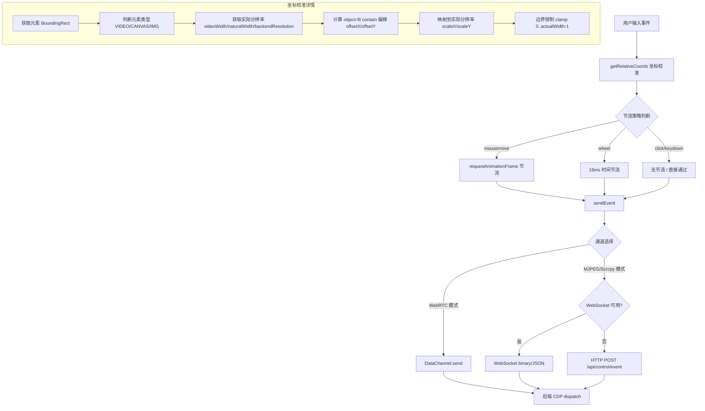

### 2.2 节流策略表

| 事件类型 | 节流方式 | 间隔/策略 | 说明 |
|---------|---------|----------|------|
| `mousemove` | `requestAnimationFrame` | ~16ms (60fps) | 非拖拽时使用 RAF；拖拽时直接发送以保证流畅 |
| `wheel` | 时间戳节流 | 16ms (`mouseMoveThrottle`) | WebSocket 模式下检查 `Date.now() - lastMouseMoveTime` |
| `click` / `mousedown` | 防抖限流 | 50ms (`clickThrottle`) | WebSocket 模式下积压超 5 个则丢弃 |
| `keydown` / `keyup` | 无节流 | 立即发送 | 通过事件队列批量发送（`batchInterval = 10ms`） |
| `dblclick` / `contextmenu` | 无节流 | 立即发送 | - |

### 2.3 通道选择逻辑

| 传输模式 | 首选通道 | 回退通道 | 二进制协议 |
|---------|---------|---------|-----------|
| WebRTC | `RTCDataChannel` (ordered, maxRetransmits=1) | 无 | 支持 (`binaryEventEncoder`) |
| MJPEG | WebSocket (port 5567) | HTTP POST `/api/control/event` | 支持 |
| Scrcpy | WebSocket (port 5567) | HTTP POST `/api/control/event` | 支持 |

**源码**：`remoteControlManager.ts:642-687`（`sendEvent` 方法通道选择逻辑）

### 2.4 数据结构

**鼠标事件 JSON Schema**：

```json
{
  "type": "click | mousedown | mouseup | mousemove | dblclick | contextmenu",
  "button": 0,
  "buttons": 0,
  "x": 960,
  "y": 540,
  "viewportWidth": 1920,
  "viewportHeight": 1080,
  "isDragging": false,
  "timestamp": 1741689600000
}
```

**键盘事件 JSON Schema**：

```json
{
  "type": "keydown | keyup | keypress",
  "key": "Enter",
  "code": "Enter",
  "keyCode": 13,
  "charCode": 13,
  "ctrlKey": false,
  "shiftKey": false,
  "altKey": false,
  "metaKey": false,
  "repeat": false,
  "timestamp": 1741689600000
}
```

**滚轮事件 JSON Schema**：

```json
{
  "type": "wheel",
  "deltaX": 0,
  "deltaY": -120,
  "deltaZ": 0,
  "deltaMode": 0,
  "x": 960,
  "y": 540,
  "viewportWidth": 1920,
  "viewportHeight": 1080,
  "timestamp": 1741689600000
}
```

### 2.5 二进制编码格式

**源码**：`mjpegEventEncoder.ts`（`MJPEGEventEncoder`）

**鼠标事件**（13 字节）：

| 偏移 | 长度 | 字段 | 类型 | 说明 |
|------|------|------|------|------|
| 0 | 1 | `type` | `Uint8` | 0=MOVE, 1=DOWN, 2=UP, 3=CLICK, 4=DBLCLICK |
| 1 | 2 | `x` | `Uint16 BE` | 坐标 X (0~65535) |
| 3 | 2 | `y` | `Uint16 BE` | 坐标 Y (0~65535) |
| 5 | 1 | `button` | `Uint8` | 鼠标按钮 (0=左, 1=中, 2=右) |
| 6 | 4 | `timestamp` | `Uint32 BE` | 时间戳低 32 位 |
| 10 | 3 | `reserved` | - | 保留字节，全 0 |

**滚轮事件**（type=5）和**键盘事件**（type=6/7/8）使用类似结构但字段含义不同，详见 `mjpegEventEncoder.ts:72+`。

**验收矩阵**：[[ACCEPTANCE_CHECKLIST#CTRL-001]] ~ [[ACCEPTANCE_CHECKLIST#CTRL-004]]

---

## Flow 3: AI 对话-执行流 (AI Conversation & Execution Flow)

用户通过聊天输入自然语言指令，后端通过 SSE 流式返回执行步骤。

**源码**：`aiCore.ts:4330-4704`（`aiSendMessage`、`handleSSEEvent`）

### 3.1 流程图

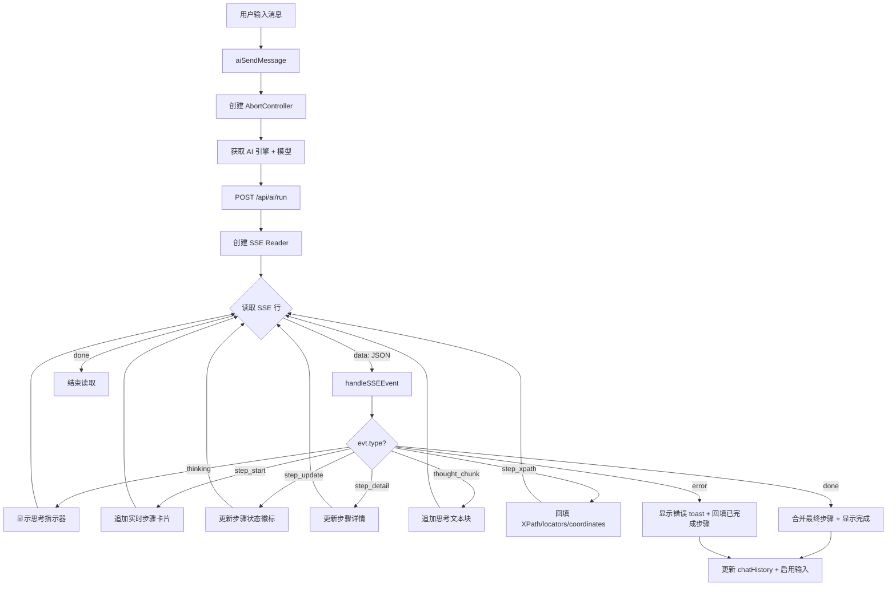

### 3.2 SSE 事件类型表

| `evt.type` | 处理逻辑 | UI 变化 | 源码行 |
|-----------|---------|--------|--------|
| `thinking` | 更新状态文本 | 显示 "正在思考..." 动画指示器 | `aiCore.ts:4577-4579` |
| `screenshot` | 保留接口，暂无处理 | 无 | `aiCore.ts:4581-4583` |
| `step_start` | 将步骤 push 到 `liveSteps`，调用 `appendLiveStep` | 在对话流中追加新步骤卡片，状态为 executing | `aiCore.ts:4585-4592` |
| `step_update` | 更新 `liveSteps[index].status` | 步骤卡片状态徽标变化（success/error/skipped） | `aiCore.ts:4595-4601` |
| `step_detail` | 调用 `updateLiveStepDetail` | 更新步骤详情面板内容 | `aiCore.ts:4603-4606` |
| `thought_chunk` | 调用 `appendThoughtChunk` | 在思考面板追加流式文本 | `aiCore.ts:4608-4611` |
| `step_xpath` | 回填 `xpath`、`xpathInfo`、`coordinates`、`locators`、`value`、`target` | 步骤卡片更新定位信息 | `aiCore.ts:4613-4628` |
| `done` | 合并 `serverSteps` 与 `liveSteps`，调用 `finalizeLiveSteps` | 显示 "已完成" + 步骤数 + 耗时 | `aiCore.ts:4630-4671` |
| `error` | 回填已完成步骤，调用 `finalizeLiveSteps` | 显示错误消息 + 已完成步骤数 | `aiCore.ts:4674-4701` |

### 3.3 步骤执行状态机

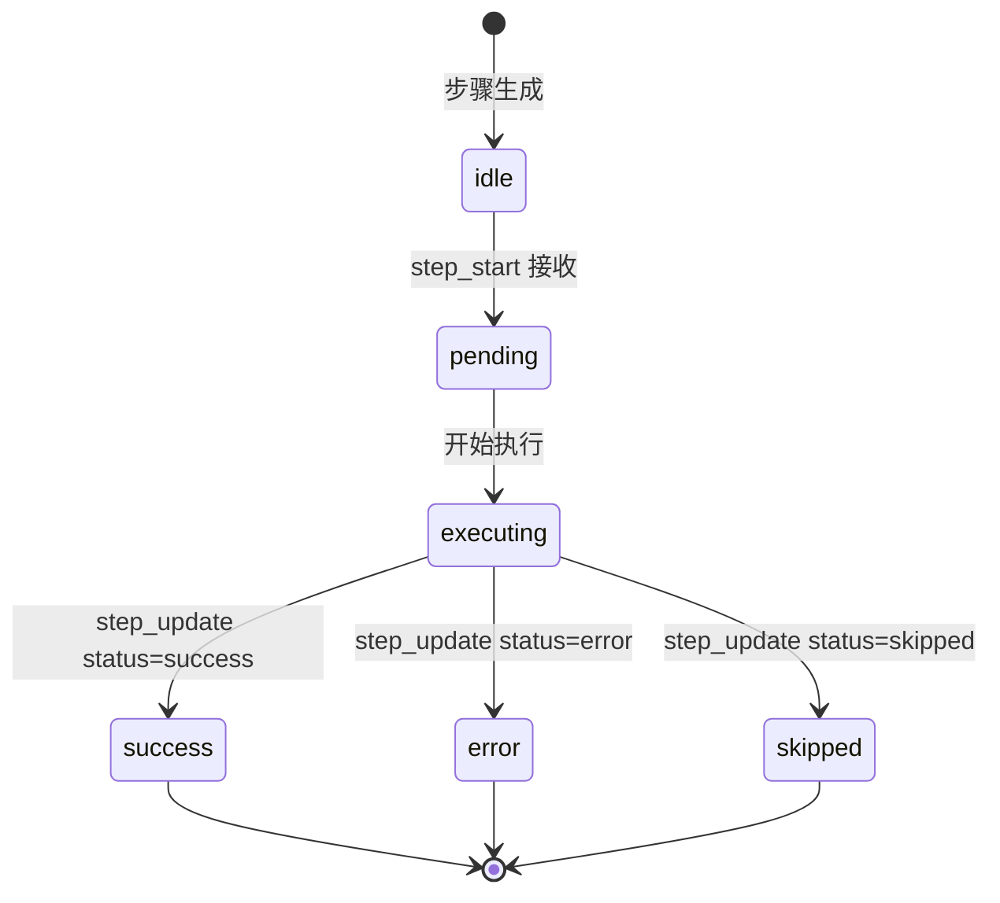

| 当前状态 | 触发事件 | 下一状态 | 说明 |
|---------|---------|---------|------|
| idle | SSE `step_start` | pending | 步骤卡片渲染，显示 spinner |
| pending | 后端开始执行 | executing | 状态文本 "正在执行..." |
| executing | SSE `step_update` status=`"success"` | success | 绿色勾号 |
| executing | SSE `step_update` status=`"error"` | error | 红色叉号 |
| executing | SSE `step_update` status=`"skipped"` | skipped | 灰色跳过标识 |

**验收矩阵**：[[ACCEPTANCE_CHECKLIST#AI-001]] ~ [[ACCEPTANCE_CHECKLIST#AI-007]]

---

## Flow 4: 录制流 (Recording Flow)

通过 CDP 事件捕捉用户在远程浏览器中的操作，转换为可回放的脚本步骤。

**源码**：`aiCore.ts:1858-2137`（`recordingStepToScriptStep`），`streamCore.ts:913-971`（`handleRecordingMessage`）

### 4.1 流程图

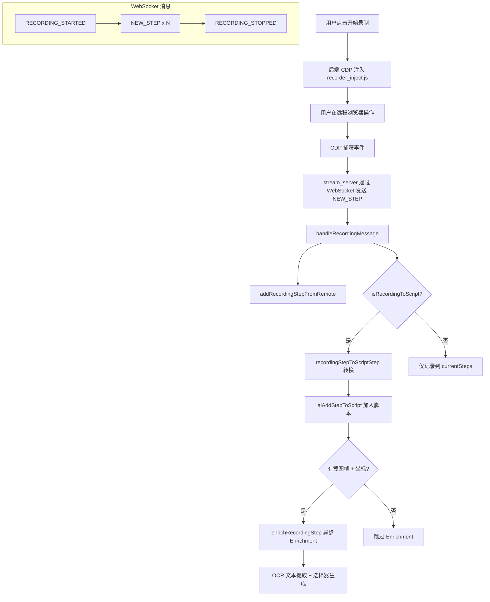

### 4.2 CDP 事件到脚本步骤的转换表

| CDP `step.type` | 脚本 `action` | `value` 来源 | `coordinates` 来源 | 说明 |
|----------------|--------------|-------------|-------------------|------|
| `click` | `click` | - | `clientX/clientY` 或 `offsetX/offsetY` | 单击 |
| `doubleClick` | `click` | - | 同上 | 映射为 click（双击语义由前端区分） |
| `change` / `input` | `input` | `step.value` | 同上 | 文本输入 |
| `keyDown` | `keypress` | `step.key` | - | 按键事件 |
| `scroll` | `scroll` | - | 同上 | 滚动 |
| `navigate` | `navigate` | `step.url` | - | 页面导航 |
| `hover` | `hover` | - | 同上 | 鼠标悬停 |

### 4.3 Enrichment 管线

| 阶段 | 输入 | 输出 | 说明 |
|------|------|------|------|
| 帧捕获 | `step._frame_base64` 或 `captureMjpegFrame()` | Base64 图片 | 优先使用服务端帧快照 |
| 选择器生成 | CDP selectors + selector_details | `locators` 对象 | 6 种定位策略（XPath/CSS/Text/AI等） |
| OCR 文本提取 | Base64 帧 + 坐标 | `locators.textContent` | 通过 OCR 服务（port 9788）提取 |

### 4.4 `locators` 数据结构

```json
{
  "xpath": { "value": "//button[@id='submit']", "enabled": true, "priority": 1 },
  "cssSelector": { "value": "#submit", "enabled": true, "priority": 2, "matchIndex": 0, "matchTotal": 1 },
  "textContent": { "value": "提交", "enabled": true, "priority": 3, "source": "dom", "matchIndex": 0, "matchTotal": 1 },
  "aiLocate": { "value": "点击提交按钮", "enabled": true, "priority": 6 }
}
```

**源码引用**：`aiCore.ts:1922-1945`（locators 构建逻辑）

**验收矩阵**：[[ACCEPTANCE_CHECKLIST#REC-001]]、[[ACCEPTANCE_CHECKLIST#REC-002]]

---

## Flow 5: 步骤编辑器校验流 (Step Editor Validation Flow)

打开步骤编辑器后的完整校验和保存流程。

**源码**：`aiCore.ts:3087-3700`（`aiOpenStepEditor`、`aiStepEditorActionChanged`、`aiSaveStepEdit`）

### 5.1 流程图

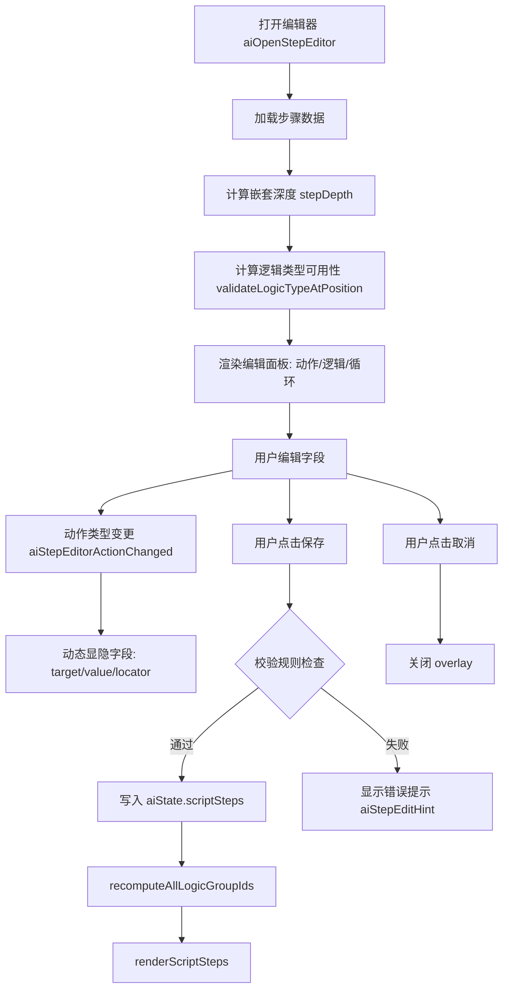

### 5.2 校验规则表

| 步骤类型 (`action`) | 字段 | 校验规则 | 错误提示 |
|--------------------|------|---------|---------|
| `navigate` | `value` (URL) | 必填，需为合法 URL | "请输入有效的 URL 地址" |
| `click` / `hover` | `x`, `y` | 必填，须为数字 | "请提供有效的坐标" |
| `input` | `value` (text) | 必填 | "请输入内容" |
| `keypress` | `value` (key) | 必填 | "请输入按键名称" |
| `wait` | `value` (duration) | 必填，须为正整数 | "请输入有效的等待时间" |
| `scroll` | `deltaX` / `deltaY` | 至少一项必填 | "请提供滚动距离" |
| `double_click` | `x`, `y` | 必填，须为数字 | "请提供有效的坐标" |
| `long_press` | `value` (ms) | 必填，须为正整数 | "请输入按压时间" |
| `drag` | `value` (JSON) | 必填，须包含 `start` 和 `end` 坐标 | "请输入有效的拖拽坐标" |
| `system_button` | `value` | 必填，须为 back/home/menu/enter | "请输入有效的系统按钮" |
| `logic` (if/else_if/else) | 逻辑组 | `validateLogicTypeAtPosition` 校验 | 见 Flow 8 详细规则 |

### 5.3 动态字段显隐规则

| `action` 值 | 显示 target | 显示 value | 显示 locator | value label |
|-------------|------------|-----------|-------------|-------------|
| `click` | 是 | 否 | 是 | - |
| `input` | 是 | 是 | 是 | "输入内容" |
| `navigate` | 否 | 是 | 否 | "URL 地址" |
| `scroll` | 是 | 否 | 否 | - |
| `keypress` | 是 | 是 | 否 | "按键名称" |
| `hover` | 是 | 否 | 是 | - |
| `wait` | 否 | 是 | 否 | "等待时间(ms)" |
| `long_press` | 是 | 是 | 是 | "按压时间(ms)" |
| `drag` | 是 | 是 | 否 | "拖拽坐标JSON" |
| `system_button` | 否 | 是 | 否 | "按钮名称(back/home/menu/enter)" |

**源码引用**：`aiCore.ts:3249-3278`（`aiStepEditorActionChanged`）

**验收矩阵**：[[ACCEPTANCE_CHECKLIST#AI-008]]

---

## Flow 6: WebSocket 消息流 (WebSocket Message Flow)

Port 5567 双向 WebSocket 通信的完整消息协议。

**源码**：`streamCore.ts:974-1161`（`connectMJPEG`），`headless/stream_server.py`

### 6.1 流程图

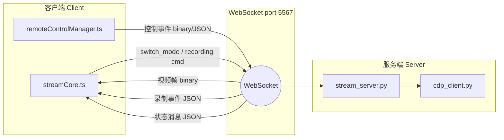

### 6.2 消息类型表

| 方向 | `type` | Payload | 处理函数 | 说明 |
|------|--------|---------|---------|------|
| C→S | `switch_mode` | `{ mode: "mjpeg" \| "h264" \| "scrcpy" }` | `stream_server.py` | 切换编码模式 |
| C→S | `control` (JSON) | `{ type: "control", event: {...}, timestamp }` | `stream_server.py → cdp_client.py` | JSON 格式控制事件 |
| C→S | (binary) | 13 字节鼠标 / 17 字节滚轮 / 变长键盘 | `stream_server.py` binary handler | 二进制编码控制事件 |
| C→S | `start_recording` | `{}` | `websocket_recorder_handler.py` | 开始录制 |
| C→S | `stop_recording` | `{}` | `websocket_recorder_handler.py` | 停止录制 |
| S→C | (binary JPEG) | 原始 JPEG 字节 | `streamCore.ts:1140-1146` | MJPEG 视频帧 |
| S→C | (binary H.264) | Magic(4) + Header + NAL Units | `streamCore.ts:1131-1137` | H.264 视频帧 |
| S→C | `RECORDING_STARTED` | `{ recording_id }` | `handleRecordingMessage` | 录制已开始 |
| S→C | `NEW_STEP` | `{ step: {...} }` | `handleRecordingMessage` | 新录制步骤 |
| S→C | `RECORDING_STOPPED` | `{ steps: number }` | `handleRecordingMessage` | 录制已停止 |
| S→C | `TAB_SWITCHED` | `{ targetId, viewport: {width, height} }` | `streamCore.ts:1090-1101` | 标签页切换 |
| S→C | `TAB_CREATED` | `{ targetId, url }` | `streamCore.ts:1103-1114` | 新标签页创建 |
| S→C | `mode_switched` | `{ mode }` | `streamCore.ts:1116-1118` | 模式切换确认 |

### 6.3 二进制帧格式

**MJPEG 帧**：原始 JPEG 数据（`ArrayBuffer`），无自定义头部。前端通过 `new Blob([data], { type: "image/jpeg" })` 直接渲染。

**H.264 帧**：自定义协议头部。

| 偏移 | 长度 | 字段 | 说明 |
|------|------|------|------|
| 0 | 4 | Magic | `H264StreamProtocol.MAGIC` 固定值 |
| 4 | N | Header | 帧元数据（大小、时间戳、帧类型） |
| 4+N | ... | NAL Units | H.264 编码数据 |

**源码引用**：`streamCore.ts:1128-1146`（帧类型判断与分发）

**验收矩阵**：[[ACCEPTANCE_CHECKLIST#CONN-001]] ~ [[ACCEPTANCE_CHECKLIST#CONN-003]]

---

## Flow 7: 传输模式切换流 (Transport Mode Switch Flow)

三种传输模式之间的切换流程及降级策略。

**源码**：`headerActions.ts:214-265`（`switchTransportMode`），`streamCore.ts`，`streamPlayerManager.ts`

### 7.1 流程图

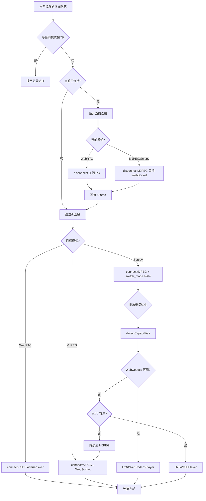

### 7.2 传输模式对比表

| 模式 | 编码 | 传输层 | 播放器 | 延迟 | 带宽 |
|------|------|--------|--------|------|------|
| WebRTC | VP8 | `RTCPeerConnection` + `RTCDataChannel` | `<video>` 元素原生播放 | 最低 (~50ms) | 15Mbps |
| MJPEG | 原始 JPEG | WebSocket (port 5567) binary | `` 元素 + Blob URL | 中 (~100ms) | 高（质量98） |
| Scrcpy | H.264 | WebSocket (port 5567) binary | `WebCodecs` > `MSE` > native | 低 (~65ms) | ~8Mbps |

### 7.3 播放器选择优先级

**源码**：`streamPlayerManager.ts:34-62`（`detectCapabilities`）

| 优先级 | 播放器类型 | 检测条件 | 容器元素 |
|-------|-----------|---------|---------|
| 1 | `H264WebCodecsPlayer` | `window.VideoDecoder` + `window.EncodedVideoChunk` 存在 | `<canvas>` |
| 2 | `H264MSEPlayer` | `MediaSource` 存在且支持 `avc1.640028` / `avc1.64001f` / `avc1.42001e` | `<video>` |
| 3 | MJPEG native | 始终可用 | `` |

### 7.4 降级回退策略

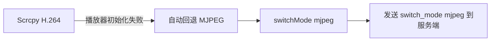

**源码引用**：`streamCore.ts:1005-1014`（H.264 播放器初始化 try/catch 回退逻辑）

**验收矩阵**：[[ACCEPTANCE_CHECKLIST#SET-004]]

---

## Flow 8: 逻辑步骤校验流 (Logic Step Validation Flow) — V2 NEW

逻辑步骤（`if` / `else_if` / `else`）的插入、编辑、删除、移动全链路校验系统。

**源码**：`aiCore.ts:279-598`（9 个校验函数）

### 8.1 流程图

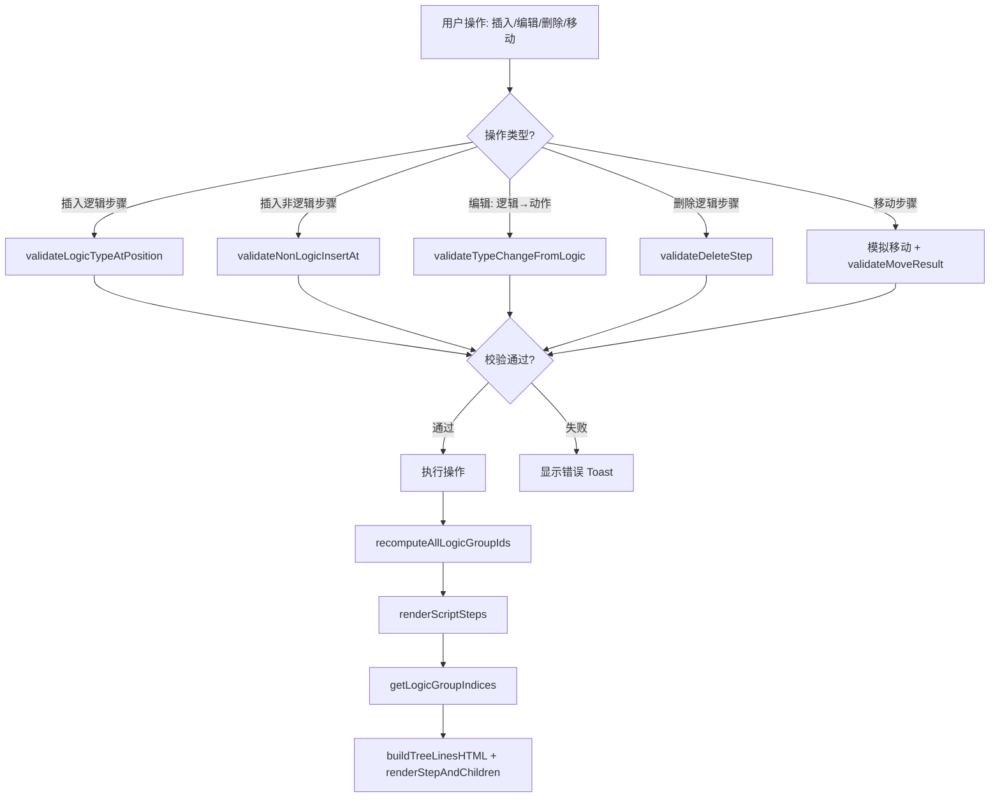

### 8.2 校验函数一览表

| 函数名 | 触发场景 | 校验逻辑 | 返回值 | 源码行 |
|--------|---------|---------|--------|--------|
| `validateLogicTypeAtPosition` | 新建/编辑逻辑步骤 | 检查 if/else_if/else 在给定位置是否合法（前后邻居约束 + 同组 else 重复检测） | `{ if: {ok, reason}, else_if: {ok, reason}, else: {ok, reason} }` | `aiCore.ts:393-458` |
| `validateNonLogicInsertAt` | 在逻辑组中间插入非逻辑步骤 | 检查插入是否打断 if→else_if/else 逻辑链 | `{ ok, reason, affectedGroupIndices }` | `aiCore.ts:464-496` |
| `validateTypeChangeFromLogic` | 将逻辑步骤改为动作/循环 | 检查后方是否有依赖此步骤的 else_if/else | `{ ok, reason }` | `aiCore.ts:503-539` |
| `validateDeleteStep` | 删除逻辑步骤 | 检查删除是否破坏逻辑组完整性（IF 头部级联、中间节点连续性） | `{ ok, reason, groupIndices, cascadeWarning }` | `aiCore.ts:546-598` |
| `validateMoveResult` | 拖拽/上移/下移步骤 | 对模拟后的步骤数组全局扫描：else_if/else 前方必须有 if/else_if，非逻辑不能夹在逻辑链中 | `{ ok, reason }` | `aiCore.ts:2562-2591` |
| `generateGroupId` | 创建新逻辑组 | 生成唯一 `lg_` 前缀 ID | `string` | `aiCore.ts:279` |
| `getSiblings` | 内部工具函数 | 获取同一 `parentId` 下的同级步骤列表 | `[{ step, idx }]` | `aiCore.ts:285-294` |
| `findLogicGroupBounds` | 查找逻辑组边界 | 从给定位置向前找 if、向后找 else/else_if 尾部 | `{ start, end } \| null` | `aiCore.ts:301-325` |
| `recomputeAllLogicGroupIds` | 任何逻辑步骤变更后 | 按 `parentId` 分组，扫描连续逻辑链分配 `logicGroupId` | `void` (修改 steps in-place) | `aiCore.ts:332-369` |

### 8.3 逻辑类型位置约束规则

| 插入的逻辑类型 | 前方邻居约束 | 后方邻居影响 | 同组约束 |
|--------------|------------|------------|---------|
| `if` | 无约束（始终可插入） | 若后方紧跟 `else_if`/`else`，新 if 会"吸收"它们（发出警告） | - |
| `else_if` | 前方必须是 `if` 或 `else_if` | - | - |
| `else` | 前方必须是 `if` 或 `else_if` | - | 同逻辑组内不能有多个 `else` |

### 8.4 逻辑组生命周期

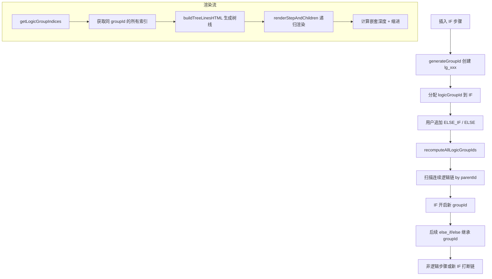

### 8.5 `recomputeAllLogicGroupIds` 算法

1. 按 `parentId` 将所有步骤分组到 `byParent` 字典
2. 对每组同级步骤按索引顺序扫描：
   - 遇到 `if`：生成新 `groupId`，标记 `expectingContinuation = true`
   - 遇到 `else_if` 且 `expectingContinuation`：继承当前 `groupId`
   - 遇到 `else` 且 `expectingContinuation`：继承 `groupId`，设 `expectingContinuation = false`
   - 遇到非逻辑步骤或孤立的 `else_if`/`else`：清除 `groupId`，重置状态

**源码引用**：`aiCore.ts:332-369`

### 8.6 删除校验决策表

| 步骤位置 | `logicType` | 后方状态 | 允许删除 | 说明 |
|---------|------------|---------|---------|------|
| 组头部 | `if` | 后方有 else_if/else | 否 | 需级联删除整个逻辑组 |
| 组头部 | `if` | 后方无同组成员 | 是 | 单独 if 可安全删除 |
| 组中间 | `else_if` | 前后均有同组成员 | 是 | 删除后前后自动连接 |
| 组尾部 | `else` | - | 是 | else 可安全删除 |
| 非逻辑 | - | - | 是 | 直接删除，不影响逻辑组 |

### 8.7 嵌套渲染

| 函数 | 职责 | 源码行 |
|------|------|--------|
| `getLogicGroupIndices(stepIdx)` | 通过 `logicGroupId` 查找同组所有步骤索引 | `aiCore.ts:374-383` |
| `buildTreeLinesHTML(step, idx)` | 根据嵌套深度和步骤位置生成竖线/拐角 SVG | `aiCore.ts:946` |
| `renderStepAndChildren(step, idx, ...)` | 递归渲染步骤及其子步骤（逻辑组连续性、缩进层级） | `aiCore.ts:967` |

最大嵌套层级为 **3 层**。编辑器中当 `stepDepth >= 3` 时禁用逻辑/循环模式按钮。

**源码引用**：`aiCore.ts:3106-3117`（嵌套深度计算 + 限制）

**验收矩阵**：[[ACCEPTANCE_CHECKLIST#AI-008]]

---

## 附录: 验收矩阵汇总

| ID 范围 | 对应流程 | 关联 PRD 模块 |
|--------|---------|-------------|
| STATE-001 ~ STATE-005 | Flow 1: 连接状态机 | [[PRD_BDD#connection-management]] |
| CTRL-001 ~ CTRL-004 | Flow 2: 远程控制事件流 | [[PRD_BDD#remote-control]] |
| AI-001 ~ AI-007 | Flow 3: AI 对话-执行流 | [[PRD_BDD#ai-conversation]] |
| AI-008 | Flow 5 + Flow 8: 步骤编辑器 + 逻辑校验 | [[PRD_BDD#step-editor]] |
| REC-001, REC-002 | Flow 4: 录制流 | [[PRD_BDD#recording]] |
| CONN-001 ~ CONN-003 | Flow 6: WebSocket 消息流 | [[PRD_BDD#websocket-protocol]] |
| SET-004 | Flow 7: 传输模式切换流 | [[PRD_BDD#transport-settings]] |

---

> 本文档基于以下源码生成，如有代码变更请同步更新：
> - `controller_ui/src/controller/streamCore.ts`
> - `controller_ui/src/controller/remoteControlManager.ts`
> - `controller_ui/src/controller/aiCore.ts`
> - `controller_ui/src/controller/streamPlayerManager.ts`
> - `controller_ui/src/controller/mjpegEventEncoder.ts`
> - `controller_ui/src/modules/headerActions.ts`
> - `headless/stream_server.py`
