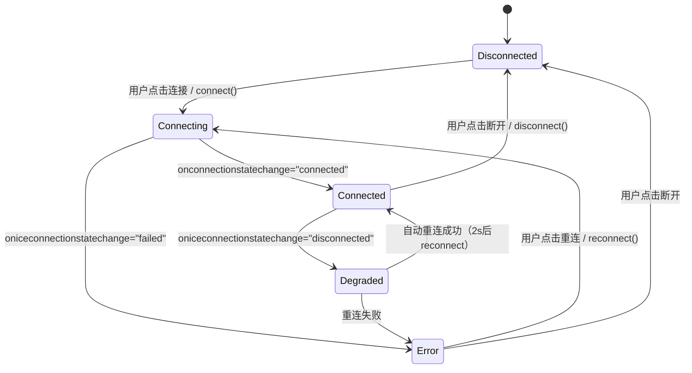
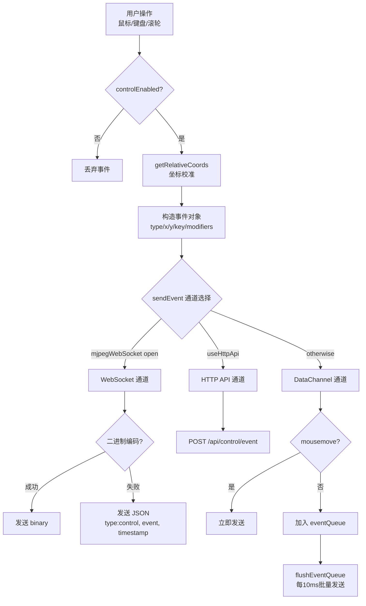
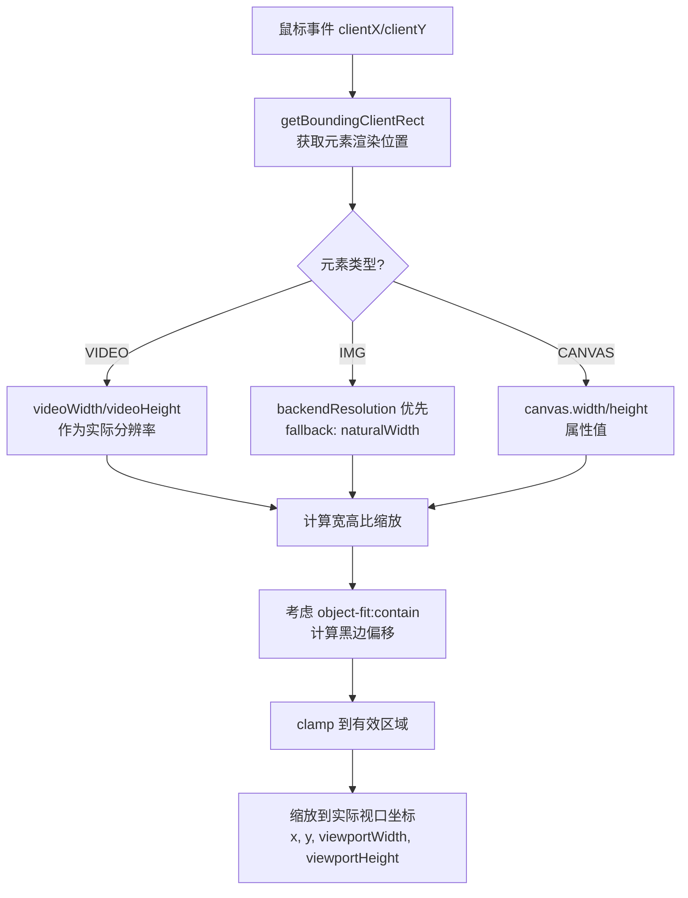
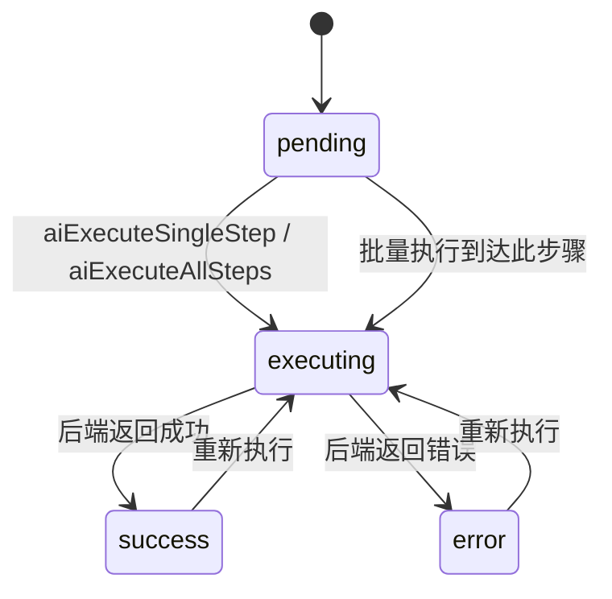
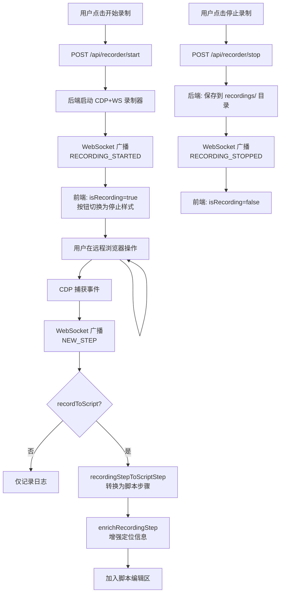
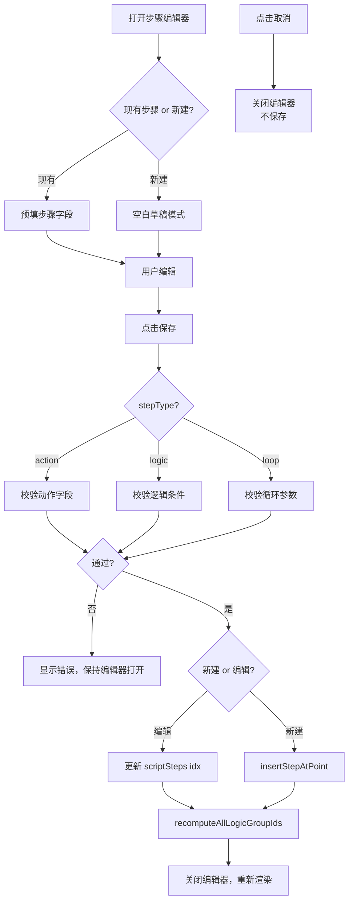
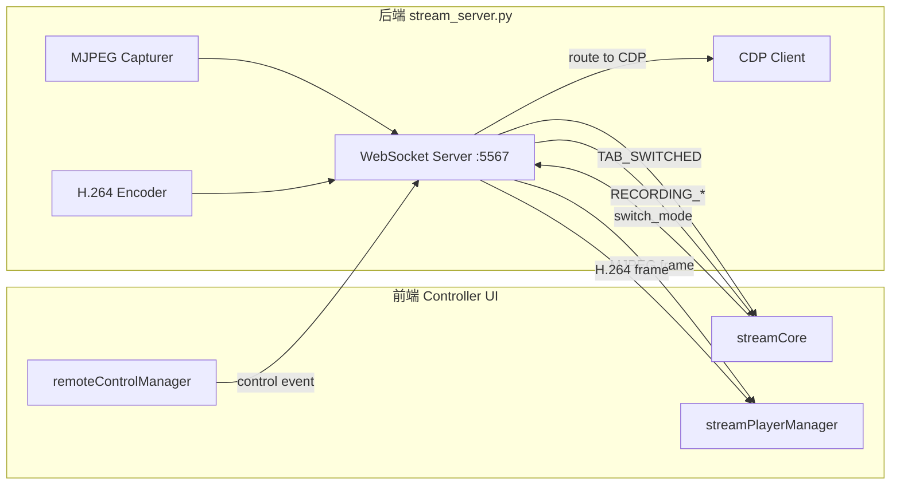
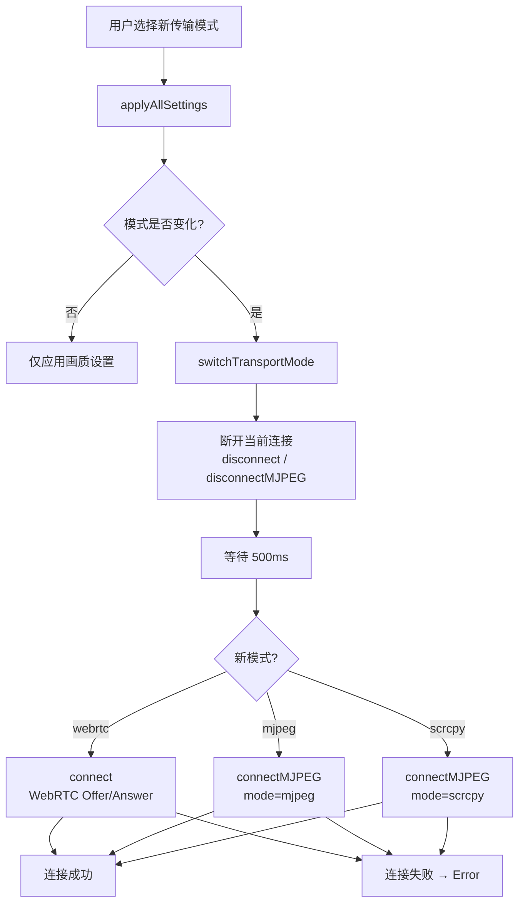
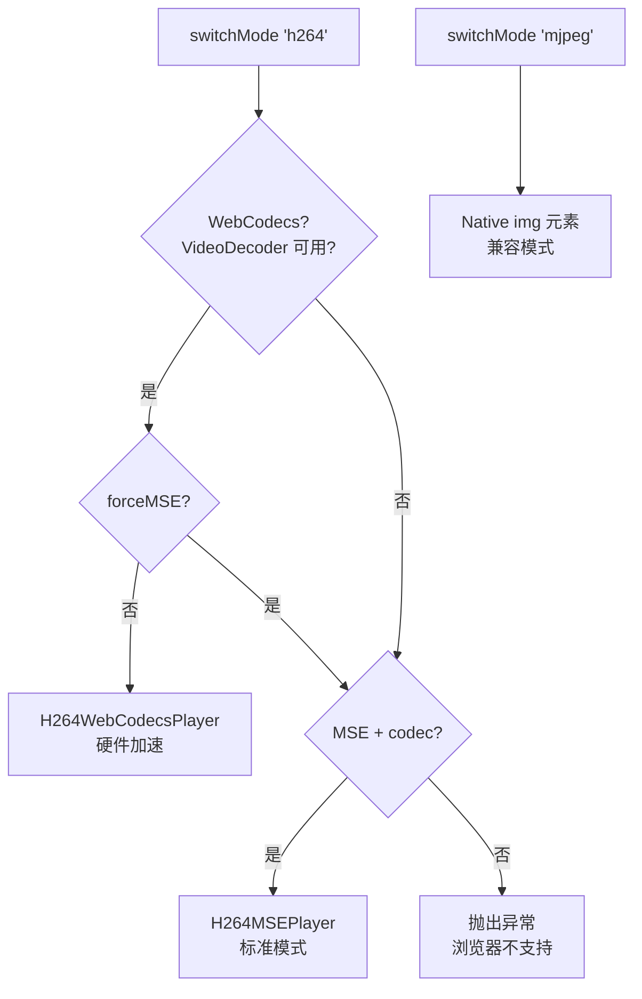

# 关键交互流程与状态机

> 本文档描述 Controller 页面的核心交互流程和状态机，使用 Mermaid 图和状态转换表。
>
> 关联文档：[[PRD_BDD]] · [[TEST_CASES]] · [[ACCEPTANCE_CHECKLIST]]

---

## 目录

1. [连接状态机](#1-连接状态机)
2. [远程控制事件流](#2-远程控制事件流)
3. [AI 对话-执行流](#3-ai-对话-执行流)
4. [录制流](#4-录制流)
5. [步骤编辑器校验流](#5-步骤编辑器校验流)
6. [WebSocket 消息流](#6-websocket-消息流)
7. [传输模式切换流](#7-传输模式切换流)

---

## 1. 连接状态机

> 对应 [[PRD_BDD#M02 — 连接状态机]]
> 源码：`streamCore.ts:778-821`，`controllerStore.ts`

### 状态图



### 状态转换表

| 当前状态 | 触发事件 | 下一状态 | 副作用 |
|---------|---------|---------|--------|
| Disconnected | `connect()` 调用 | Connecting | 禁用 connectBtn；创建 RTCPeerConnection；发起 SDP 协商 |
| Disconnected | `connectMJPEG()` 调用 | Connecting | 创建 WebSocket 到 ws://hostname:5567 |
| Connecting | `onconnectionstatechange: "connected"` | Connected | isConnected=true；启用 disconnectBtn；启动所有轮询；refreshStatus/refreshTabs |
| Connecting | `oniceconnectionstatechange: "failed"` | Error | 更新状态文本；显示 reconnectBtn |
| Connecting | WebSocket `onopen` | Connected | 发送 switch_mode；初始化远程控制；启动轮询和统计 |
| Connected | `oniceconnectionstatechange: "disconnected"` | Degraded | 状态文本="连接中断，正在重连..."；2s 定时器触发 reconnect() |
| Connected | `disconnect()` 调用 | Disconnected | 关闭 PC/WS；停止所有轮询；隐藏视频；显示 placeholder；reset store |
| Connected | WebSocket `onclose` | Disconnected | 停止所有轮询；更新状态 |
| Degraded | reconnect 成功 | Connected | 恢复正常状态 |
| Degraded | reconnect 失败 | Error | 显示 reconnectBtn |
| Error | `reconnect()` 调用 | Connecting | 先 disconnect 再 connect |
| Error | `disconnect()` 调用 | Disconnected | 清理资源 |

### 状态对应 UI 变化

| 状态 | statusText | connectBtn | disconnectBtn | placeholder | video/image | reconnectBtn |
|------|-----------|------------|---------------|-------------|-------------|-------------|
| Disconnected | "未连接" | 启用 | 禁用 | 显示 | 隐藏 | 隐藏 |
| Connecting | "正在连接..." | 禁用 | 禁用 | 显示 | 隐藏 | 隐藏 |
| Connected | "已连接" | 禁用 | 启用 | 隐藏 | 显示 | 隐藏 |
| Degraded | "连接中断，正在重连..." | 禁用 | 启用 | 隐藏 | 显示 | 隐藏 |
| Error | "连接失败" | 禁用 | 启用 | 隐藏 | 显示 | 显示 |

---

## 2. 远程控制事件流

> 对应 [[PRD_BDD#M10 — 鼠标单击/双击/右键]] 至 [[PRD_BDD#M17 — 事件传输通道]]
> 源码：`remoteControlManager.ts`

### 事件流程图



### 坐标校准流程



### 事件数据结构

**鼠标事件 JSON：**
```json
{
  "type": "click",
  "x": 512,
  "y": 384,
  "button": 0,
  "viewportWidth": 1920,
  "viewportHeight": 1080
}
```

**键盘事件 JSON：**
```json
{
  "type": "keydown",
  "key": "a",
  "code": "KeyA",
  "keyCode": 65,
  "ctrlKey": false,
  "shiftKey": false,
  "altKey": false,
  "metaKey": false,
  "repeat": false
}
```

**滚轮事件 JSON：**
```json
{
  "type": "wheel",
  "x": 512,
  "y": 384,
  "deltaX": 0,
  "deltaY": -120,
  "deltaZ": 0
}
```

### 节流策略表

| 事件类型 | 通道 | 节流方式 | 间隔 | 说明 |
|---------|------|---------|------|------|
| mousemove | WebSocket | 时间戳比较 | 16ms (~60fps) | `lastMouseMoveTime` 判断 |
| mousemove | HTTP API | 时间戳比较 | 16ms | 同上 |
| mousemove | DataChannel | requestAnimationFrame | ~16ms | rAF 去重 |
| mousemove (拖拽中) | 所有 | 无节流 | 立即 | isDragging=true 时跳过节流 |
| click/mousedown | WebSocket | 时间戳+计数 | 50ms | `clickThrottle`，最多 5 pending |
| wheel | 所有 | 无节流 | 立即 | — |
| keydown/keyup | 所有 | 无节流 | 立即 | — |
| 组合输入 | 所有 | compositionend 触发 | — | 仅在确认时发送 |

### 二进制协议格式

| 事件类型 | 字节数 | 格式 |
|---------|-------|------|
| 鼠标事件 | 13 | `[type:1][x:2][y:2][button:1][timestamp:4][reserved:3]` |
| 滚轮事件 | 17 | `[type:1][x:2][y:2][deltaY:4][deltaX:4][timestamp:4]` |
| 键盘事件 | 可变 | `[type:1][keyCode:2][modifiers:1][timestamp:4][key:N]` |

**事件类型编码：**

| 编码 | 事件类型 |
|------|---------|
| 0 | mousemove |
| 1 | mousedown |
| 2 | mouseup |
| 3 | click |
| 4 | dblclick |
| 5 | wheel |
| 6 | keydown |
| 7 | keyup |
| 8 | keypress |

---

## 3. AI 对话-执行流

> 对应 [[PRD_BDD#M38 — AI对话-发送消息]] 至 [[PRD_BDD#M41 — AI对话-浮框操作]]
> 源码：`aiCore.ts:4330-4799`

### 对话流程图

```mermaid
flowchart TD
    A[用户输入消息] --> B{消息非空?}
    B -->|否| Z[不处理]
    B -->|是| C[追加用户消息气泡]
    C --> D[清空输入框]
    D --> E[显示 thinking 指示器]
    E --> F[POST /api/ai/run<br/>SSE 流式请求]
    F --> G{SSE 事件}
    G -->|thinking| H[追加思考块]
    G -->|step_start| I[追加步骤卡片<br/>状态: executing]
    G -->|step_update| J[更新步骤状态/详情]
    G -->|done| K[最终化步骤<br/>添加"加入脚本"按钮]
    G -->|error| L[显示错误信息]
    H --> G
    I --> G
    J --> G
    K --> M[恢复输入框<br/>isProcessing=false]
    L --> M

    N[用户点击停止] --> O[AbortController.abort]
    O --> P[显示已生成步骤<br/>状态: stopped]
```

### SSE 事件类型表

| 事件类型 | 数据载荷 | 处理逻辑 | UI 变化 |
|---------|---------|---------|---------|
| `thinking` | `{ text }` | 追加思考块到回复容器 | 显示思考内容面板 |
| `step_start` | `{ index, step }` | 创建步骤卡片，加入 liveSteps | 新步骤卡片出现（executing 图标） |
| `step_update` | `{ index, status, detail? }` | 更新步骤状态和详情 | 步骤图标更新（✓/✗） |
| `done` | `{ steps, timing }` | finalizeLiveSteps，显示操作按钮 | "加入脚本"/"全部加入"按钮出现 |
| `error` | `{ message }` | 提取错误摘要，显示错误 | 错误状态样式，错误详情 |

### 步骤执行状态机



### 步骤执行状态转换表

| 当前状态 | 触发事件 | 下一状态 | 副作用 |
|---------|---------|---------|--------|
| pending | `aiExecuteSingleStep(idx)` | executing | POST /api/ai/execute-step；UI 显示执行中 |
| pending | 批量执行到达 | executing | currentExecutingIndex = idx |
| executing | 后端返回 success | success | 记录 duration；clearStepFailure；更新 UI |
| executing | 后端返回 error | error | setStepFailure(简化错误)；显示错误详情 |
| success | 用户再次执行 | executing | 重新发送请求 |
| error | 用户再次执行 | executing | 清除旧错误，重新发送 |

---

## 4. 录制流

> 对应 [[PRD_BDD#M58 — 录制-开始/停止]] 至 [[PRD_BDD#M60 — 录制-Enrichment]]
> 源码：`aiCore.ts:1858-2137`，`streamCore.ts:906-972`

### 录制流程图



### CDP 事件到脚本步骤转换表

| CDP 事件类型 | 脚本 action | target 来源 | value 来源 | locators 填充 |
|-------------|------------|------------|-----------|--------------|
| click | click | selectors[0] / target | — | xpath, cssSelector, coordinates |
| dblclick | double_click | selectors[0] | — | xpath, cssSelector, coordinates |
| input / keydown (文本) | input | selectors[0] | step.value | xpath, cssSelector |
| navigate | navigate | — | step.url | — |
| scroll | scroll | selectors[0] | deltaY | xpath, coordinates |
| keypress | keypress | — | step.key | — |
| hover | hover | selectors[0] | — | xpath, cssSelector |

### Enrichment 数据流

| 增强项 | 数据来源 | API | locator 键 | 条件 |
|--------|---------|-----|-----------|------|
| 图像模板 | frameBase64 截图 | — (直接赋值) | `imageTemplate` | 有截图 |
| 归一化坐标 | x, y, viewport | — (计算) | `normalizedCoords` | 有坐标和视口信息 |
| OCR 文本 | 截图 + 坐标 | POST /api/ocr/extract-text | `textContent` (source: "ocr") | 有截图 |
| VLM OCR | 截图 + 坐标 | POST 3100/api/vlm-ocr/start | `textContent` (source: "vlm") | 手动触发 |

---

## 5. 步骤编辑器校验流

> 对应 [[PRD_BDD#M47 — 步骤编辑器-打开/关闭]] 至 [[PRD_BDD#M50 — 步骤编辑器-保存校验]]
> 源码：`aiCore.ts:3087-3700`

### 编辑校验流程图



### 校验规则表

| 步骤类型 | 字段 | 校验规则 | 错误提示 |
|---------|------|---------|---------|
| action: click | target | 非空 | "请填写目标元素" |
| action: input | target | 非空 | "请填写目标元素" |
| action: input | value | 非空 | "请填写输入值" |
| action: navigate | value | 合法 URL | "请填写导航 URL" |
| action: wait | value | 正整数 | "请填写等待时间(ms)" |
| action: keypress | value | 非空 | "请填写按键" |
| action: scroll | value | 数字 | "请填写滚动量" |
| logic: if | conditions | 至少 1 个条件 | "IF 步骤需要至少一个条件" |
| logic: else_if | conditions | 至少 1 个条件 | "ELSE IF 需要至少一个条件" |
| logic: else | — | 无额外校验 | — |
| logic: if/else_if | position | validateLogicTypeAtPosition | "此位置不允许插入该逻辑类型" |

### 逻辑类型位置校验表

| 位置条件 | IF 允许? | ELSE_IF 允许? | ELSE 允许? |
|---------|---------|-------------|-----------|
| 空列表/无前驱 | ✓ | ✗ | ✗ |
| 前驱为普通步骤 | ✓ | ✗ | ✗ |
| 前驱为 IF 步骤 | ✓ | ✓ | ✓ |
| 前驱为 ELSE_IF 步骤 | ✓ | ✓ | ✓ |
| 前驱为 ELSE 步骤 | ✓ | ✗ | ✗ |
| 同组已有 ELSE | — | ✓ (在 ELSE 前) | ✗ (重复) |

---

## 6. WebSocket 消息流

> 端口 5567 双向通信
> 源码：`headless/stream_server.py`，`streamCore.ts:974-1161`

### 消息流向图



### 消息类型表

| 方向 | type | payload 示例 | 处理函数 | 源码位置 |
|------|------|-------------|---------|---------|
| C→S | `switch_mode` | `{ type: "switch_mode", mode: "mjpeg" }` | `_handle_mode_switch()` | stream_server.py:402 |
| C→S | `connect` | `{ type: "connect" }` | 发送 welcome | stream_server.py:246 |
| C→S | `control` | `{ type: "control", event: {...} }` | `_control_callback()` | stream_server.py:255 |
| C→S | binary | 二进制编码的控制事件 | `_handle_binary_event()` | stream_server.py:284 |
| C→S | `recorder` | `{ type: "recorder", data: {...} }` | `_recorder_callback()` | stream_server.py:262 |
| C→S | `query_element` | `{ type: "query_element", request_id, ... }` | `_element_query_callback()` | stream_server.py:270 |
| S→C | binary (MJPEG) | JPEG 原始字节 | `streamPlayerManager.receiveMJPEGFrame()` | streamCore.ts:1133-1140 |
| S→C | binary (H.264) | `[magic:4][type:1][data:N]` | `handleH264Message()` | streamCore.ts:1095-1125 |
| S→C | `TAB_SWITCHED` | `{ type: "TAB_SWITCHED", activeTabId, ... }` | 更新标签页状态 | streamCore.ts:1092-1103 |
| S→C | `TAB_CREATED` | `{ type: "TAB_CREATED", targetId }` | 500ms 后切换 | streamCore.ts:1105 |
| S→C | `mode_switched` | `{ type: "mode_switched", mode }` | 记录日志 | streamCore.ts:1107 |
| S→C | `RECORDING_STARTED` | `{ type: "RECORDING_STARTED" }` | 设置录制状态 | streamCore.ts:914 |
| S→C | `NEW_STEP` | `{ type: "NEW_STEP", recordingId, step }` | 转换/增强步骤 | streamCore.ts:926 |
| S→C | `RECORDING_STOPPED` | `{ type: "RECORDING_STOPPED", steps }` | 结束录制 | streamCore.ts:960 |
| S→C | `connected` | `{ type: "connected", mode, server_version }` | 连接确认 | stream_server.py:248 |
| S→C | `element_info` | `{ type: "element_info", request_id, result }` | 元素查询结果 | stream_server.py:275 |

### H.264 流协议

| 字段 | 偏移 | 大小 | 说明 |
|------|------|------|------|
| Magic Number | 0 | 4 bytes | `0xABCDEF00` |
| Message Type | 4 | 1 byte | 0x01=VIDEO_FRAME, 0x02=INIT_DATA |
| Payload Length | 5 | 4 bytes | 数据长度 |
| Data | 9 | N bytes | H.264 NALU 数据 |

VIDEO_FRAME 额外字段：

| 字段 | 说明 |
|------|------|
| pts | 展示时间戳 |
| isKeyframe | 是否为关键帧（IDR） |

---

## 7. 传输模式切换流

> 对应 [[PRD_BDD#M22 — 传输模式切换]]
> 源码：`headerActions.ts:214-265`

### 切换流程图



### 传输模式对比表

| 特性 | WebRTC | MJPEG | Scrcpy (H.264) |
|------|--------|-------|----------------|
| 协议 | RTCPeerConnection | WebSocket (5567) | WebSocket (5567) |
| 视频格式 | VP8 | JPEG 帧序列 | H.264 NAL Units |
| 渲染元素 | `<video>` | `` | `<canvas>` (WebCodecs) 或 `<video>` (MSE) |
| 控制通道 | DataChannel | 同一 WebSocket | 同一 WebSocket |
| 延迟 | 最低 | 中等 | 低 |
| 兼容性 | 需 WebRTC 支持 | 全浏览器 | 需 WebCodecs/MSE |
| 播放器自动选择 | — | — | WebCodecs > MSE > 不支持 |

### StreamPlayerManager 播放器选择逻辑


